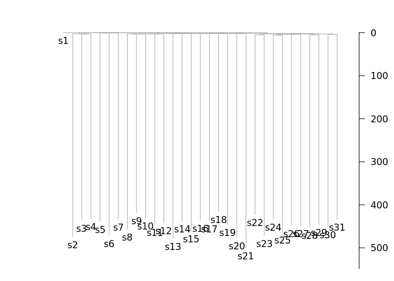
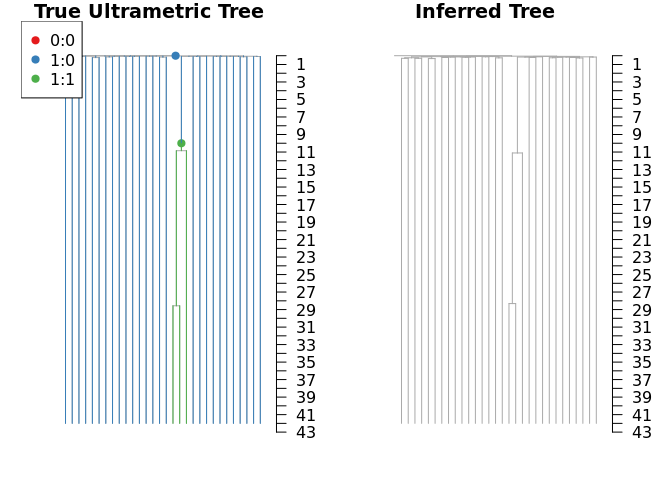

Introduction to rtreefit
================
09/05/2023

<!-- README.md is generated from README.Rmd. Please edit that file -->

## Installation

<!-- badges: start -->
<!-- badges: end -->

You can install rtreefit like so:

``` r
devtools::install_github("nangalialab/rtreefit",build_vignettes=TRUE)
```

## Introduction

This package estimates time-based (“ultrametric”) trees, wherein the
y-axis of phylogenetic somatic mutation trees is converted from
mutations to time. The method jointly fits wild type rates, mutant rates
and absolute time branch lengths using a Bayesian per individual
tree-based model under the assumption that the observed branch lengths
are Poisson or Negative Binomial distributed with

Mean = Duration × Sensitivity × Mutation Rate

The method works with at most one change point per branch and supports
heterochronous sampling. See the rtreefit vignette for slightly fuller
mathematical details:

``` r
browseVignettes("rtreefit") 
```

## Branch Timings and Per Driver Clade Mutation Rate

We consider a rooted tree where each edge

consists of an observed mutation count

and a true duration
.
We refer to a given edge and its child node interchangeably by the same
label. Now let
")
be the set of terminal nodes (tips) that descend from node

and let
")
be its corresponding set of ancestral nodes excluding the root. We
assume that each tip of the tree

has a known corresponding time

(e.g. the post conception age in years of the patient at sampling of the
cell) and so we therefore have the following constraint:

}t_i")

and


We incorporate this constraint by performing the optimisation over the
interior branches of the tree with reparameterised branch durations

transformed to be in the range
.
If

is an edge whose parent node is the root then:

})")

For other interior edges,
,
we have

}\right\}-\sum_{j\in A(i)} t_j\right)x_i")

The duration of the terminal edges is fixed by the values of

on the interior edges and the overall duration constraint:

}\right\}-\sum_{j\in A(i)} t_j")

We assume that there are

change points in the tree corresponding to the acquisition of driver
mutations. This results in

mutation rates

applying throughout the tree where we allow at most one change point per
branch and the initial ancestral (or wild type) rate is

and additional rate change points occur a fraction

along branch

and descendent branches have the rate

unless there are additional change points in descendant branches. The
effective rate on branches with a change point going from

to

is just the weighted average
\lambda_j")
where we use a uniform unit interval prior for the
’s.

### Negative Binomial Model

We assume the underlying mutation process follows a Negative Binomial
Distribution with the above piecewise constant driver specific mutation
rates, the number of mutations accrued on branch

in time

measured in years:

")

The number of observed mutations is:

")

Where we are using a per-branch estimated sensitivity

that indirectly depends on the depth of sample and the number of samples
sharing a branch (see ?). This is equivalent too:

")

with priors
"),
")
where

is the naive estimation of a single rate

as the per patient median of the ratio of the root to tip mutation count
and the tip sampling age, and finally we use the weakly informative
prior for the stick breaking fractions:

}p_j),\beta=1)")

where the

is an initial approximation of the duration of the branch length
expressed as a fraction of the sampling time:

}\left\{(m_j+1)/(\sum_{k\in A(j)}\left(m_k+1\right))\right\}")

Note that the overdispersion parameter is rescaled so that it is
comparable across branches with different mutation burden.

### Poisson Model

Here we assume the underlying mutation process follows a Poisson
Distribution again with the above piecewise constant driver specific
mutation rates, the number of observed mutations accrued on branch

in time

measured in years:

")

where

/s_i\right)")

Where we have chosen the concentration parameter
.
This reflects only modest uncertainty in our estimates in sensitivity
and also allows the model to mitigate larger than expected variability
in the branch lengths. In other respects the priors are the same as for
the Negative Binomial Model.

### Examples

## Neutral Case. One Rate

First lets simulate a neutral tree using rsimpop and fit the tree..

``` r
library("rtreefit")## Loads rsimpop as well
NYEARS=25
RATE=18
get_agedf_from_sim=function(simtree){
  st=get_elapsed_time_tree(simtree)## Gets "Real Time" ultrametric tree
  nh=nodeHeights(st)
  out=data.frame(tip.label=st$tip.label,age=nh[match(1:length(st$tip.label),st$edge[,2]),2]/365)
  out$age=ifelse(out$age<1e-6,1e-6,out$age)
  out
}
testing=run_neutral_sim(0.1,1/365,nyears=NYEARS)
#> n_sim_days: 9125
#> b_stop_if_empty: 0
#> b_stop_at_pop_size: 1
#> maxt: 0
#> driver_rate_per_cell_per_day: 0
#> max_driver_count: -1
#> MAX_EVENTS= 18250 
#> MAX_SIZE= 300003 
#> n_sim_days: 9125
#> b_stop_if_empty: 0
#> b_stop_at_pop_size: 0
#> maxt: 152.215721405264
#> driver_rate_per_cell_per_day: 0
#> max_driver_count: -1
#> MAX_EVENTS= 18250 
#> MAX_SIZE= 300003
st=get_subsampled_tree(testing,30)
#> Starting checking the validity of tmp...
#> Found number of tips: n = 31 
#> Found number of nodes: m = 30 
#> Done.
st=get_elapsed_time_tree(st,mutrateperdivision = 0,backgroundrate = RATE/365,odf=1)

plot_tree(st)
```



    #> 
    #> Phylogenetic tree with 31 tips and 30 internal nodes.
    #> 
    #> Tip labels:
    #>   s1, s2, s3, s4, s5, s6, ...
    #> 
    #> Rooted; includes branch lengths.
    st$agedf=get_agedf_from_sim(st)
    res=fit_tree(tree=st,switch_nodes = c(),xcross = c(),niter = 10000,model = "poisson_tree",early_growth_model_on = 0.0)
    #> Warning in fit_tree(tree = st, switch_nodes = c(), xcross = c(), niter =
    #> 10000, : No sensitivity supplied: assuming 99%
    #> Median lambda estimate=18.34
    print(res$lambda)
    #> $mean
    #> [1] 18.37413
    #> 
    #> $sd
    #> [1] 0.1804631
    #> 
    #> $lb
    #> [1] 18.02837
    #> 
    #> $ub
    #> [1] 18.73339
    #> 
    #> $median
    #> [1] 18.37147
    par(mfcol=c(1,2))
    ut=get_elapsed_time_tree(st)
    ut$edge.length=ut$edge.length/365
    plot_tree(ut,cex.label = 0);title("True Ultrametric Tree")
    #> 
    #> Phylogenetic tree with 31 tips and 30 internal nodes.
    #> 
    #> Tip labels:
    #>   s1, s2, s3, s4, s5, s6, ...
    #> 
    #> Rooted; includes branch lengths.
    plot_tree(res$ultratree,cex.label = 0);title("Inferred Tree")
    #> 
    #> Phylogenetic tree with 31 tips and 30 internal nodes.
    #> 
    #> Tip labels:
    #>   s1, s2, s3, s4, s5, s6, ...
    #> 
    #> Rooted; includes branch lengths.


## Selection Case. Two fitted rates - both the same..

``` r
NYEARS=40
RATE=15
selsim=run_selection_sim(0.1,1/365,target_pop_size = 1e5,nyears_driver_acquisition = 5,nyears = NYEARS,fitness=0.3,minprop = 0.05)
#> n_sim_days: 1825
#> b_stop_if_empty: 0
#> b_stop_at_pop_size: 1
#> maxt: 0
#> driver_rate_per_cell_per_day: 0
#> max_driver_count: -1
#> MAX_EVENTS= 3650 
#> MAX_SIZE= 300003 
#> n_sim_days: 1825
#> b_stop_if_empty: 0
#> b_stop_at_pop_size: 0
#> maxt: 128.203400258896
#> driver_rate_per_cell_per_day: 0
#> max_driver_count: -1
#> MAX_EVENTS= 3650 
#> MAX_SIZE= 300003 
#> No driver found: tries= 0 
#>    population val fitness id driver1
#> 1           1   0     0.0  0       0
#> 2       99950   1     0.0  0       0
#> 21          1   1     0.3  1       1
#> n_sim_days: 14600
#> b_stop_if_empty: 1
#> b_stop_at_pop_size: 0
#> maxt: 1825.00043855212
#> driver_rate_per_cell_per_day: 0
#> max_driver_count: -1
#> MAX_EVENTS= 29200 
#> MAX_SIZE= 300003 
#> No driver found: tries= 1 
#>    population val fitness id driver1
#> 1           1   0     0.0  0       0
#> 2       99950   1     0.0  0       0
#> 21          1   1     0.3  1       1
#> n_sim_days: 14600
#> b_stop_if_empty: 1
#> b_stop_at_pop_size: 0
#> maxt: 1825.00043855212
#> driver_rate_per_cell_per_day: 0
#> max_driver_count: -1
#> MAX_EVENTS= 29200 
#> MAX_SIZE= 300003 
#> No driver found: tries= 2 
#>    population val fitness id driver1
#> 1           1   0     0.0  0       0
#> 2       99950   1     0.0  0       0
#> 21          1   1     0.3  1       1
#> n_sim_days: 14600
#> b_stop_if_empty: 1
#> b_stop_at_pop_size: 0
#> maxt: 1825.00043855212
#> driver_rate_per_cell_per_day: 0
#> max_driver_count: -1
#> MAX_EVENTS= 29200 
#> MAX_SIZE= 300003 
#> No driver found: tries= 3 
#>    population val fitness id driver1
#> 1           1   0     0.0  0       0
#> 2       99950   1     0.0  0       0
#> 21          1   1     0.3  1       1
#> n_sim_days: 14600
#> b_stop_if_empty: 1
#> b_stop_at_pop_size: 0
#> maxt: 1825.00043855212
#> driver_rate_per_cell_per_day: 0
#> max_driver_count: -1
#> MAX_EVENTS= 29200 
#> MAX_SIZE= 300003 
#> No driver found: tries= 4 
#>    population val fitness id driver1
#> 1           1   0     0.0  0       0
#> 2       99950   1     0.0  0       0
#> 21          1   1     0.3  1       1
#> n_sim_days: 14600
#> b_stop_if_empty: 1
#> b_stop_at_pop_size: 0
#> maxt: 1825.00043855212
#> driver_rate_per_cell_per_day: 0
#> max_driver_count: -1
#> MAX_EVENTS= 29200 
#> MAX_SIZE= 300003
st=get_subsampled_tree(selsim,30)
#> Starting checking the validity of tmp...
#> Found number of tips: n = 31 
#> Found number of nodes: m = 30 
#> Done.
st=get_elapsed_time_tree(st,mutrateperdivision = 0,backgroundrate = RATE/365,odf=1)
st$agedf=get_agedf_from_sim(st)
node=st$events$node[which(st$events$driverid==1)]
res=fit_tree(tree=st,switch_nodes = node,xcross = c(),niter = 10000,model = "poisson_tree",early_growth_model_on = 0.0)
#> Warning in fit_tree(tree = st, switch_nodes = node, xcross = c(), niter =
#> 10000, : No sensitivity supplied: assuming 99%
#> Median lambda estimate=15.33
print(res$lambda)
#> $mean
#> lambda[1] lambda[2] 
#>  15.26276  15.72464 
#> 
#> $sd
#> lambda[1] lambda[2] 
#> 0.1466417 0.5097143 
#> 
#> $lb
#> lambda[1] lambda[2] 
#>  14.98038  14.78105 
#> 
#> $ub
#> lambda[1] lambda[2] 
#>  15.55108  16.77022 
#> 
#> $median
#> lambda[1] lambda[2] 
#>  15.26248  15.70489
ut=get_elapsed_time_tree(st)
ut$edge.length=ut$edge.length/365
par(mfcol=c(1,2))
plot_tree(ut,cex.label = 0);title("True Ultrametric Tree")
#> 
#> Phylogenetic tree with 31 tips and 30 internal nodes.
#> 
#> Tip labels:
#>   s1, s2, s3, s4, s5, s6, ...
#> 
#> Rooted; includes branch lengths.
plot_tree(res$ultratree,cex.label = 0);title("Inferred Tree")
#> 
#> Phylogenetic tree with 31 tips and 30 internal nodes.
#> 
#> Tip labels:
#>   s1, s2, s3, s4, s5, s6, ...
#> 
#> Rooted; includes branch lengths.
```


