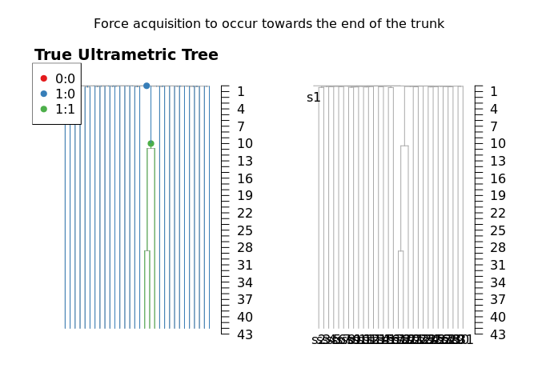

Introduction to rtreefit
================
29/01/2025

<!-- README.md is generated from README.Rmd. Please edit that file -->

## Installation

<!-- badges: start -->
<!-- badges: end -->

You can install rtreefit like so:

``` r
devtools::install_github("nangalialab/rtreefit",build_vignettes=TRUE)
```

## Introduction

This package estimates time-based (“ultrametric”) trees, wherein the
y-axis of phylogenetic somatic mutation trees is converted from
mutations to time. The method jointly fits wild type rates, mutant rates
and absolute time branch lengths using a Bayesian per individual
tree-based model under the assumption that the observed branch lengths
are Poisson or Negative Binomial distributed with

Mean = Duration × Sensitivity × Mutation Rate

The method works with at most one change point per branch and supports
heterochronous sampling. See the rtreefit vignette for slightly fuller
mathematical details:

``` r
browseVignettes("rtreefit") 
```

## Branch Timings and Per Driver Clade Mutation Rate

We consider a rooted tree where each edge $i$ consists of an observed
mutation count $m_i$ and a true duration $t_i$. We refer to a given edge
and its child node interchangeably by the same label. Now let $D(i)$ be
the set of terminal nodes (tips) that descend from node $i$ and let
$A(i)$ be its corresponding set of ancestral nodes excluding the root.
We assume that each tip of the tree $k$ has a known corresponding time
$T_k$ (e.g. the post conception age in years of the patient at sampling
of the cell) and so we therefore have the following constraint:

$$ T_k=\sum_{i \in A(k)}t_i $$

and

$$ T_k> t_i > 0 $$

We incorporate this constraint by performing the optimisation over the
interior branches of the tree with reparameterised branch durations
$x_i$ transformed to be in the range $0< x_i <1$. If $j$ is an edge
whose parent node is the root then:

$$ t_j=x_j  \text{min}({T_k:k \in D(j)}) $$

For other interior edges, $i$, we have

$$ t_i=\left(\text{min}\left(T_k:k \in D(i)\right) -\sum_{j\in A(i)} t_j\right)x_i $$

The duration of the terminal edges is fixed by the values of $t_i$ on
the interior edges and the overall duration constraint:

$$ t_i=\text{min}\left(T_k:k \in D(i)\right)-\sum_{j\in A(i)} t_j $$

We assume that there are $p-1$ change points in the tree corresponding
to the acquisition of driver mutations. This results in $p$ mutation
rates $\lambda_j$ applying throughout the tree where we allow at most
one change point per branch and the initial ancestral (or wild type)
rate is $\lambda_0$ and additional rate change points occur a fraction
$\alpha_j$ along branch $j$ and descendent branches have the rate
$\lambda_j$ unless there are additional change points in descendant
branches. The effective rate on branches with a change point going from
$\lambda_l$ to $\lambda_j$ is just the weighted average
$\alpha_j \lambda_l+(1-\alpha_j)\lambda_j$ where we use a uniform unit
interval prior for the $\alpha$’s.

### Negative Binomial Model

We assume the underlying mutation process follows a Negative Binomial
Distribution with the above piecewise constant driver specific mutation
rates, the number of mutations accrued on branch $i$ in time $t_i$
measured in years:

$$ M_i \sim \text{NB}\left(\lambda\times t_i,\lambda\times t_i\times \phi\right) $$

The number of observed mutations is:

$$ m_i \sim \text{Binomial}(M_i,s_i) $$

Where we are using a per-branch estimated sensitivity $s_i$ that
indirectly depends on the depth of sample and the number of samples
sharing a branch (see ?). This is equivalent too:

$$ m_i \sim \text{NB}\left(\lambda\times t_i \times s_i,\lambda\times t_i\times \phi\right) $$

with priors $1/\phi \sim \text{HalfNormal}(0,10)$,
$\lambda \sim \mathcal{N}(\Lambda,0.25 \Lambda)$ where $\Lambda$ is the
naive estimation of a single rate $\lambda$ as the per patient median of
the ratio of the root to tip mutation count and the tip sampling age,
and finally we use the weakly informative prior for the stick breaking
fractions:

$$x_i \sim \text{Beta}(\alpha=p_i/(1-\sum_{j\in A(i)}p_j),\beta=1)$$

where the $p_i$ is an initial approximation of the duration of the
branch length expressed as a fraction of the sampling time:

$$ p_i=\text{min}\left(j\in D(i)\right) \frac{m_j+1}{\Sigma_{k\in A(j)}(m_k+1)} $$

Note that the overdispersion parameter is rescaled so that it is
comparable across branches with different mutation burden.

### Poisson Model

Here we assume the underlying mutation process follows a Poisson
Distribution again with the above piecewise constant driver specific
mutation rates, the number of observed mutations accrued on branch $i$
in time $t_i$ measured in years:

$$ m_i \sim \text{Poisson}(\lambda\times t_i\times S_i) $$

where

$$ S_i \sim \text{Beta}\left(\alpha=c,\beta=c(1-s_i)/s_i\right)$$

Where we have chosen the concentration parameter $c=100$. This reflects
only modest uncertainty in our estimates in sensitivity and also allows
the model to mitigate larger than expected variability in the branch
lengths. In other respects the priors are the same as for the Negative
Binomial Model.

### Examples

## Neutral Case. One Rate

First lets simulate a neutral tree using rsimpop and fit the tree..

``` r
library("rtreefit")## Loads rsimpop as well
NYEARS=25
RATE=18
get_agedf_from_sim=function(simtree){
  st=get_elapsed_time_tree(simtree)## Gets "Real Time" ultrametric tree
  nh=nodeHeights(st)
  out=data.frame(tip.label=st$tip.label,age=nh[match(1:length(st$tip.label),st$edge[,2]),2]/365)
  out$age=ifelse(out$age<1e-6,1e-6,out$age)
  out
}
testing=run_neutral_sim(0.1,1/365,nyears=NYEARS)
#> n_sim_days: 9125
#> b_stop_if_empty: 0
#> b_stop_at_pop_size: 1
#> maxt: 0
#> driver_rate_per_cell_per_day: 0
#> max_driver_count: -1
#> nmigration: 0
#> MAX_EVENTS= 9125000 
#> MAX_SIZE= 310003 
#> n_sim_days: 9125
#> b_stop_if_empty: 0
#> b_stop_at_pop_size: 0
#> maxt: 158.164823897412
#> driver_rate_per_cell_per_day: 0
#> max_driver_count: -1
#> nmigration: 0
#> MAX_EVENTS= 9125000 
#> MAX_SIZE= 310003
st=get_subsampled_tree(testing,30)
#> Starting checking the validity of tmp...
#> Found number of tips: n = 31 
#> Found number of nodes: m = 30 
#> Done.
st=get_elapsed_time_tree(st,mutrateperdivision = 0,backgroundrate = RATE/365,odf=1)

plot_tree(st)
```


    #> 
    #> Phylogenetic tree with 31 tips and 30 internal nodes.
    #> 
    #> Tip labels:
    #>   s1, s2, s3, s4, s5, s6, ...
    #> 
    #> Rooted; includes branch lengths.
    st$agedf=get_agedf_from_sim(st)
    res=fit_tree(tree=st,switch_nodes = c(),xcross = c(),niter = 10000,model = "poisson_tree",early_growth_model_on = 0.0)
    #> Warning in fit_tree(tree = st, switch_nodes = c(), xcross = c(), niter = 10000,
    #> : No sensitivity supplied: assuming 99%
    #> Median lambda estimate=18.02
    print(res$lambda)
    #> $mean
    #> [1] 18.16738
    #> 
    #> $sd
    #> [1] 0.166991
    #> 
    #> $lb
    #> [1] 17.84365
    #> 
    #> $ub
    #> [1] 18.50194
    #> 
    #> $median
    #> [1] 18.16628
    par(mfcol=c(1,2))
    ut=get_elapsed_time_tree(st)
    ut$edge.length=ut$edge.length/365
    plot_tree(ut,cex.label = 0);title("True Ultrametric Tree")
    #> 
    #> Phylogenetic tree with 31 tips and 30 internal nodes.
    #> 
    #> Tip labels:
    #>   s1, s2, s3, s4, s5, s6, ...
    #> 
    #> Rooted; includes branch lengths.
    plot_tree(res$ultratree,cex.label = 0);title("Inferred Tree")
    #> 
    #> Phylogenetic tree with 31 tips and 30 internal nodes.
    #> 
    #> Tip labels:
    #>   s1, s2, s3, s4, s5, s6, ...
    #> 
    #> Rooted; includes branch lengths.


## Selection Case.

### Two fitted rates - both the same..

``` r
NYEARS=42
RATE=20
set.seed(12345)
selsim=run_selection_sim(0.1,1/365,target_pop_size = 1e5,nyears_driver_acquisition = 10,nyears = NYEARS,fitness=0.3,minprop = 0.1)
#> n_sim_days: 3650
#> b_stop_if_empty: 0
#> b_stop_at_pop_size: 1
#> maxt: 0
#> driver_rate_per_cell_per_day: 0
#> max_driver_count: -1
#> nmigration: 0
#> MAX_EVENTS= 3650000 
#> MAX_SIZE= 310003 
#> n_sim_days: 3650
#> b_stop_if_empty: 0
#> b_stop_at_pop_size: 0
#> maxt: 110.011292493931
#> driver_rate_per_cell_per_day: 0
#> max_driver_count: -1
#> nmigration: 0
#> MAX_EVENTS= 3650000 
#> MAX_SIZE= 310003 
#> No driver found: tries= 0 
#>    population val fitness id driver1
#> 1           1   0     0.0  0       0
#> 2      100009   1     0.0  0       0
#> 21          1   1     0.3  1       1
#> n_sim_days: 15330
#> b_stop_if_empty: 1
#> b_stop_at_pop_size: 0
#> maxt: 3650.00179412198
#> driver_rate_per_cell_per_day: 0
#> max_driver_count: -1
#> nmigration: 0
#> MAX_EVENTS= 15330000 
#> MAX_SIZE= 310033 
#> No driver found: tries= 1 
#>    population val fitness id driver1
#> 1           1   0     0.0  0       0
#> 2      100009   1     0.0  0       0
#> 21          1   1     0.3  1       1
#> n_sim_days: 15330
#> b_stop_if_empty: 1
#> b_stop_at_pop_size: 0
#> maxt: 3650.00179412198
#> driver_rate_per_cell_per_day: 0
#> max_driver_count: -1
#> nmigration: 0
#> MAX_EVENTS= 15330000 
#> MAX_SIZE= 310033 
#> No driver found: tries= 2 
#>    population val fitness id driver1
#> 1           1   0     0.0  0       0
#> 2      100009   1     0.0  0       0
#> 21          1   1     0.3  1       1
#> n_sim_days: 15330
#> b_stop_if_empty: 1
#> b_stop_at_pop_size: 0
#> maxt: 3650.00179412198
#> driver_rate_per_cell_per_day: 0
#> max_driver_count: -1
#> nmigration: 0
#> MAX_EVENTS= 15330000 
#> MAX_SIZE= 310033
st=get_subsampled_tree(selsim,30)
#> Starting checking the validity of tmp...
#> Found number of tips: n = 31 
#> Found number of nodes: m = 30 
#> Done.
st=get_elapsed_time_tree(st,mutrateperdivision = 0,backgroundrate = RATE/365,odf=1)
st$agedf=get_agedf_from_sim(st)
node=st$events$node[which(st$events$driverid==1)]
res=fit_tree(tree=st,switch_nodes = node,xcross = c(-1),niter = 10000,model = "poisson_tree",early_growth_model_on = 0.0)
#> Warning in fit_tree(tree = st, switch_nodes = node, xcross = c(-1), niter =
#> 10000, : No sensitivity supplied: assuming 99%
#> Median lambda estimate=20.44
print(res$lambda)
#> $mean
#> lambda[1] lambda[2] 
#>  20.44269  20.64339 
#> 
#> $sd
#> lambda[1] lambda[2] 
#> 0.1433005 0.6399483 
#> 
#> $lb
#> lambda[1] lambda[2] 
#>  20.16755  19.42434 
#> 
#> $ub
#> lambda[1] lambda[2] 
#>  20.72615  21.93099 
#> 
#> $median
#> lambda[1] lambda[2] 
#>  20.44195  20.63704
ut=get_elapsed_time_tree(st)
ut$edge.length=ut$edge.length/365
par(mfcol=c(1,2))
plot_tree_events(ut,cex.label = 0);title("True Ultrametric Tree")
#> 
#> Phylogenetic tree with 31 tips and 30 internal nodes.
#> 
#> Tip labels:
#>   s1, s2, s3, s4, s5, s6, ...
#> 
#> Rooted; includes branch lengths.
plot_tree(res$ultratree,cex.label = 0);title("Inferred Tree")
#> 
#> Phylogenetic tree with 31 tips and 30 internal nodes.
#> 
#> Tip labels:
#>   s1, s2, s3, s4, s5, s6, ...
#> 
#> Rooted; includes branch lengths.
```


### 2 fitted rates - both different

``` r
### Reinstate time based tree
st=get_elapsed_time_tree(st)
### generate poisson distributed burden based differing rates
LAMBDA_WT=20
LAMBDA_MUT=40
stats=st$events %>% filter(driverid==1) 
TS=stats$ts/365
## Convert tree to years
st$edge.length=st$edge.length/365
nh=nodeHeights(st)
## classify branches.
mutbranches=get_all_node_children(stats$node,st)
muttrunk=stats$node
wtbranches=setdiff(st$edge[,2],c(mutbranches,muttrunk))
## 
idx=which(st$edge[,2]==muttrunk)
rates=data.frame(node=c(muttrunk,mutbranches,wtbranches),
                 rate=c(((TS-nh[idx,1])*LAMBDA_WT+(nh[idx,2]-TS)*LAMBDA_MUT)/(nh[idx,2]-nh[idx,1]),
                        rep(LAMBDA_MUT,length(mutbranches)),
                        rep(LAMBDA_WT,length(wtbranches)))
)
st$edge.length=rpois(length(st$edge.length),st$edge.length*(data.frame(node=st$edge[,2],duration=st$edge.length) %>% left_join(rates) %>% pull(rate)))
#> Joining with `by = join_by(node)`
st$agedf=get_agedf_from_sim(st)

node=muttrunk
res=fit_tree(tree=st,switch_nodes = node,xcross = c(-1),niter = 10000,model = "poisson_tree",early_growth_model_on = 0.0)
#> Warning in fit_tree(tree = st, switch_nodes = node, xcross = c(-1), niter =
#> 10000, : No sensitivity supplied: assuming 99%
#> Median lambda estimate=20.08
ut=get_elapsed_time_tree(st)
ut$edge.length=ut$edge.length/365
par(mfcol=c(1,2),oma=c(1,1,3,1))
plot_tree_events(ut,cex.label = 0);title("True Ultrametric Tree")
#> 
#> Phylogenetic tree with 31 tips and 30 internal nodes.
#> 
#> Tip labels:
#>   s1, s2, s3, s4, s5, s6, ...
#> 
#> Rooted; includes branch lengths.
plot_tree(res$ultratree)
#> 
#> Phylogenetic tree with 31 tips and 30 internal nodes.
#> 
#> Tip labels:
#>   s1, s2, s3, s4, s5, s6, ...
#> 
#> Rooted; includes branch lengths.
mtext("Uniform prior on trunk",outer = TRUE,line=1)
```


``` r
res=fit_tree(tree=st,switch_nodes = node,xcross = c(0.999),niter = 10000,model = "poisson_tree",early_growth_model_on = 0.0)
#> Warning in fit_tree(tree = st, switch_nodes = node, xcross = c(0.999), niter =
#> 10000, : No sensitivity supplied: assuming 99%
#> Median lambda estimate=20.08
ut=get_elapsed_time_tree(st)
ut$edge.length=ut$edge.length/365
par(mfcol=c(1,2),oma=c(1,1,3,1))
plot_tree_events(ut,cex.label = 0);title("True Ultrametric Tree")
#> 
#> Phylogenetic tree with 31 tips and 30 internal nodes.
#> 
#> Tip labels:
#>   s1, s2, s3, s4, s5, s6, ...
#> 
#> Rooted; includes branch lengths.
plot_tree(res$ultratree)
#> 
#> Phylogenetic tree with 31 tips and 30 internal nodes.
#> 
#> Tip labels:
#>   s1, s2, s3, s4, s5, s6, ...
#> 
#> Rooted; includes branch lengths.
mtext("Force acquisition to occur towards the end of the trunk",outer = TRUE,line=1)
```


